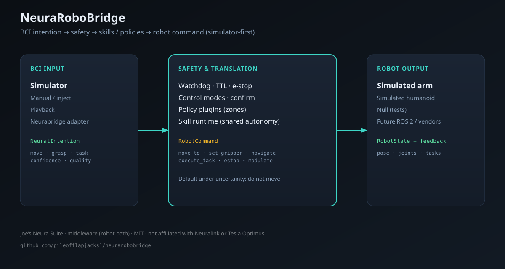

# NeuraRoboBridge

**Production-quality BCI-to-Robot connector / middleware for TypeScript.**

NeuraRoboBridge translates high-level **neural intentions** into **safe robot control commands** — for simulated robotic arms, simplified humanoids, and future real platforms.

Applications and robot stacks should **never** talk directly to raw BCI hardware. NeuraRoboBridge is the safety-conscious translation layer in the middle.

[](https://github.com/pileofflapjacks1/neurarobobridge)
[](https://neurabeach.vercel.app/projects/neurarobobridge)
[](./LICENSE)



> **Simulator-first.** Primary backends today: **BCI Simulator** + **Simulated Robot** (arm / humanoid).  
> There is **no real Neuralink access** and **no real commercial humanoid (e.g. Optimus) API**. Those surfaces are plugin-ready for later — we do not invent vendor protocols.

### Safety & claims (read this)

- **Computer-side / research / simulation only.** Not implant firmware. Not a medical device (SaMD). Not therapy software.
- **Not affiliated with Neuralink, Tesla, Optimus, or any implant/robot vendor.**
- Default under uncertainty: **do not move** (explicit `enableControl()`, e-stop, watchdog, confirm for high-risk tasks).
- Package asserts `banned_claims: true` in [`neurabeach-manifest.json`](./neurabeach-manifest.json).

### Joe’s Neura Suite

| Piece | Role |
|-------|------|
| **[NeuraBeach](https://neurabeach.vercel.app)** | Discover / catalog |
| **[Neurabridge](https://github.com/pileofflapjacks1/neurabridge)** | BCI → app/UI intents (middleware) |
| **NeuraRoboBridge** (this repo) | High-level intents → **safe robot** commands (middleware, robot path) |
| **[NeuraBinder](https://github.com/pileofflapjacks1/neurabinder)** | Reference app demo (UI) |
| **Intent → OS** | OS pointer adapter (parallel path) |

```
Neurabridge (optional)  ──adapter──▶  NeuraRoboBridge  ──▶  simulated arm / humanoid
        UI / app intents              safety · skills · policies
```

Neurabridge focuses on delivering neural intent to **applications**.  
NeuraRoboBridge focuses on turning intent into **physical (or simulated) robot action** with safety designed in.

Catalog: [NeuraBeach · col-neura-suite](https://neurabeach.vercel.app/collections/col-neura-suite) · Upload notes: [`LISTING.md`](./LISTING.md) · Demo guide: [`docs/DEMO.md`](./docs/DEMO.md) · **[FAQ](#faq--can-i-connect-my-neuralink)**

---

## FAQ — Can I connect my Neuralink?

**Short answer: no — not to this GitHub project, and not the way people imagine “plug implant → repo.”**  
That is not a missing install step. It is the **fundamental shape of the stack**.

### The fundamental truth

```
┌─────────────────────────────┐
│  Implant / clinical BCI     │  ← Owned by the device company (e.g. Neuralink)
│  Surgery, firmware, trials  │     Clinical software. Not open GitHub USB.
└──────────────┬──────────────┘
               │  (only if/when they expose a *computer-side* intent stream)
               ▼
┌─────────────────────────────┐
│  Computer-side apps & libs  │  ← This is where NeuraRoboBridge lives
│  Decoded *intentions*       │     Safety, skills, robot commands, simulators
│  GitHub, demos, APIs        │
└──────────────┬──────────────┘
               ▼
┌─────────────────────────────┐
│  Robot / OS / UI backends   │  ← Simulated today; real robots later via plugins
└─────────────────────────────┘
```

| Layer | Who owns it | Open source today? |
|-------|-------------|--------------------|
| Implant hardware & firmware | Device maker (Neuralink, etc.) | **No** |
| Clinical / patient app stack | Device maker | **Usually no** |
| **High-level intent → safe robot action** | **You + this middleware** | **Yes — this repo** |
| Robot drivers (ROS, vendor SDKs) | Robot makers / you | Partial / future |

**GitHub is not a Neuralink port.**  
Cloning this repository does **not** authenticate, stream from, or control an implant.

### What NeuraRoboBridge actually is

- **Computer-side middleware** for the era when high-bandwidth BCIs and capable robots are common.
- It consumes **high-level intentions** (`move`, `grasp`, `task`, confidence, …) — not raw spikes from a chip.
- It enforces **safety** (enable gate, e-stop, confidence, timeouts, policies, skills).
- It drives **robot backends** — today **simulators**; later real arms/humanoids via plugins.

It is **not**:

- Implant firmware or a medical device  
- An official Neuralink (or Tesla Optimus) product  
- A public “log in with your Neuralink” connector  

### “How do I connect my Neuralink to the bridge?”

| Situation | What to do |
|-----------|------------|
| You want to try the software | Use the **[live demo](https://neurarobobridge.vercel.app)** or `npm run demo` — **simulator only**, no implant. |
| You are a Neuralink clinical user | Use **Neuralink’s own approved apps / stack**. This repo does not attach to the implant. |
| You are a developer building for the future | Build against the **simulator** and the **BCI backend plugin API**. When a vendor publishes a **public computer-side** intent API, write a backend that maps it into `NeuralIntention` events. |
| You expected Bluetooth-style pairing to GitHub | That model does not exist for these implants. The missing piece is a **vendor computer-side API**, not a cable. |

### What would a real connection look like *later*?

Only if a BCI company exposes something **on the computer** (intent stream, SDK, WebSocket, etc.):

1. Their software (or SDK) produces **decoded intents** or control signals on the PC.  
2. A **custom BCI backend** for this library maps those into NeuraRoboBridge intentions.  
3. NeuraRoboBridge applies **safety** and talks to a **robot backend**.

Until that public computer-side interface exists, **step 1 is not available to open source**. We deliberately do **not** invent a fake Neuralink protocol.

### How apps in this suite fit together

| Project | Job |
|---------|-----|
| **NeuraBeach** | Catalog / discover computer-side BCI tools |
| **Neurabridge** | BCI-style intents → **apps / UI** |
| **NeuraRoboBridge** | Intents → **safe robot** commands |
| **NeuraBinder / NeuraShell** | Example **products** using the computer-side path |

All of them are **computer-side / research / simulation**. None of them are the implant.

### Try it without any hardware

```bash
npm run demo
# or open https://neurarobobridge.vercel.app
```

Connect → **Enable control** → skills / keyboard. Everything is simulated.

---

## Why NeuraRoboBridge?

| Problem | Approach |
|---------|----------|
| Apps wire BCI hardware straight to robots | Stable API + modular backends |
| Neural signals are noisy | Confidence gates, rate limits, stale TTL, watchdog |
| Mistaken commands can cause harm | E-stop, enable gate, confirm, policy plugins |
| Hardware is scarce | Simulator BCI + simulated arm/humanoid |
| Humanoid use is task-level | Skill runtime (shared autonomy) |
| Robot platforms will churn | Plugin robot backends |

---

## Quick start

```bash
git clone https://github.com/pileofflapjacks1/neurarobobridge
cd neurarobobridge
npm install
npm run build
npm test
npm run example:skills
```

```ts
import { NeuraRoboBridge } from "neurarobobridge";

const bridge = new NeuraRoboBridge({
  bciBackend: "simulator",
  robotBackend: "simulated-arm",
  safety: {
    minConfidence: 0.75,
    enableEmergencyStop: true,
    workspaceLimits: {
      min: { x: -0.8, y: -0.8, z: 0 },
      max: { x: 0.8, y: 0.8, z: 1.2 },
    },
  },
  bciSimulator: {
    scenario: "pick-place",
  },
  skills: { enabled: true },
  policies: {
    noFreeMoveDuringSkill: true,
  },
});

bridge.on("intention", (intent) => {
  console.log("intention", intent.kind, intent.confidence);
});
bridge.on("skill", (s) => console.log("skill", s.skillName, s.status, s.message));
bridge.on("robotState", (state) => console.log("robot", state.mode));
bridge.on("safetyEvent", (event) => console.warn("safety", event.reason, event.message));

await bridge.connect();
await bridge.enableControl(); // explicit enable — required for motion
```

### Examples

```bash
npm run example:basic       # pick-place scenario → simulated arm
npm run example:safety      # confidence, workspace, rate limit, e-stop
npm run example:humanoid    # modes, confirm-to-execute, tasks
npm run example:skills      # skill runtime + policy plugins + Neurabridge map
```

**Live demo (Vercel):** [neurarobobridge.vercel.app](https://neurarobobridge.vercel.app) · also `/demo`

```bash
npm run demo           # local Vite demo (http://localhost:5174)
npm run build:demo     # static build → demo/dist (Vercel output)
```

---

## Architecture

```
┌─────────────────────┐     ┌──────────────────────────┐     ┌─────────────────────┐
│   BCI Input Side    │     │  Safety & Translation    │     │  Robot Output Side  │
│  Simulator / Manual │────▶│  modes · watchdog · TTL  │────▶│  Simulated arm      │
│  Playback           │     │  policies · skills       │     │  Simulated humanoid │
│  Neurabridge adapt.│     │  confirm · e-stop        │     │  Null / future ROS  │
└─────────────────────┘     └──────────────────────────┘     └─────────────────────┘
```

Docs: [`docs/architecture.md`](./docs/architecture.md) · [`docs/adding-backends.md`](./docs/adding-backends.md) · [`docs/skills-policies-neurabridge.md`](./docs/skills-policies-neurabridge.md)

---

## Safety model

1. **Emergency stop** — highest priority; latches until cleared  
2. **Control enable + modes** — `disabled` · `supervised` · `shared` · `teleop` · `autonomous_task`  
3. **BCI liveness watchdog** — silence → fail-safe stop  
4. **Stale intention TTL**  
5. **Confidence / quality thresholds**  
6. **Confirm-to-execute** for high-risk tasks / navigate  
7. **Robot capabilities** handshake  
8. **Policy plugins** — keep-out, geofence, speed zones, no loco while grasping  
9. **Skill runtime** — multi-step shared autonomy with modulate / cancel  
10. **Rate limiting**, workspace / joint limits, max speed  

---

## Skills, policies, Neurabridge

```ts
// Shared-autonomy skill
bridge.injectIntention({
  kind: "task",
  confidence: 0.92,
  payload: { task: "pick_object", position: { x: 0.3, y: 0.1, z: 0.25 } },
});

// Policies
new NeuraRoboBridge({
  policies: {
    keepOutZones: [{ id: "stairs", min: { x: 2, y: -1, z: 0 }, max: { x: 4, y: 1, z: 2 } }],
    noLocomotionWhileGrasping: true,
  },
});

// Optional Neurabridge glue (zero hard dependency)
import { attachNeurabridge } from "neurarobobridge";
attachNeurabridge(neuralBridgeInstance, bridge);
```

Built-in skills: `pick_object`, `place_object`, `hand_over`, `follow_me`, `go_to`, `open_door`, `wait`, `wave`.

### Timeouts & needs_help

Skills time out per step (default 8s) and overall (default 60s). On failure the runtime:

1. Marks the skill `needs_help` (or `failed`)
2. Emits `feedback` with `kind: "needs_help"`
3. Applies **safe-fail recovery**: `stop` + open gripper

```bash
npm test                 # includes golden scenario pack
npm run test:scenarios   # CI scenarios only
```

CI: GitHub Actions on `main` / PRs (typecheck · tests · library + demo build).

### Black-box session export

```ts
const box = bridge.exportBlackBox({ meta: { run: "lab-1" } });
// box.whyItMoved · box.summary · box.narrative
const report = bridge.exportBlackBoxReport();
```

Live demo: **Export black-box JSON / report** after a session.

---

## Project layout

```
neurarobobridge/
├── src/          # core, safety, skills, policy, bci, robot, adapters
├── tests/        # Vitest (52+)
├── examples/     # vanilla Node + browser
├── docs/         # architecture, demo, assets
├── LISTING.md    # NeuraBeach upload helper
└── neurabeach-manifest.json
```

---

## Development

```bash
npm install
npm run typecheck
npm test
npm run build
```

- **Language:** TypeScript strict  
- **Tests:** Vitest  
- **Bundler:** tsup (ESM + CJS + `.d.ts`)  
- **Runtime:** Node ≥ 18 and modern browsers  
- **Dependencies:** none in production  

---

## Package

```ts
import { NeuraRoboBridge } from "neurarobobridge";
```

Version **0.3.0** · package name `neurarobobridge`.

---

## License

MIT — see [LICENSE](./LICENSE).
